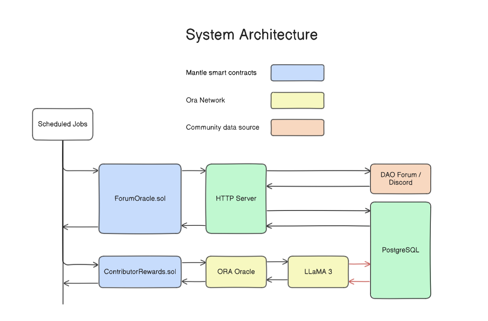

# Coincentive

# Introduction

Inactive and not-driven communities are a huge problem in the crypto space. Most of the votes on DAO are made by the largest holders who do not engage in discussions. Attempts to solve this problem by rewording the most active users simply fail when bots flood the forums and Discord servers with spam. Another issue arises when a small number of people manually pick the rewarded contributors. This way of selection may be deceptive to bias and corruption.

Our solution comes in handy to solve all of these problems by using AI and specifically verifiable Large Language Models.
Doing it this way gives users a verifiable and fair judgment to pick and reward the most active contributors. LLMs are good at analyzing text so they can pick not only the most active users but also select the ones that have given the most valuable insights.

## Architecture

## Roadmap

## Contracts

`SepoliaETH`
ForumOracle 0x1Da6F526e173A674F0fa3aCDe58Eac8216B9A069
Prompt `0x9A6FcEBF843da3223c69C4ad3Da48d262844b27C`
ContributorRewards `0xbB97588DB744aBcf1069Ee1A37f1588bcEffcd6b`

`MANTLE Mainnnet`
ForumOracle `0xaA7001907F58bBb569D809b8416Cd50761fe956e`
Prompt `0xa84Fab07Ac781e9F5ADE524455457baceC52453b`
AIOracle `0x3B5e84A519619c86FFe9606260dF34b0aAA2331D`
ContributorRewards `0x253AE16767d12C9eDC07F56656e9d22c09e8De59`
